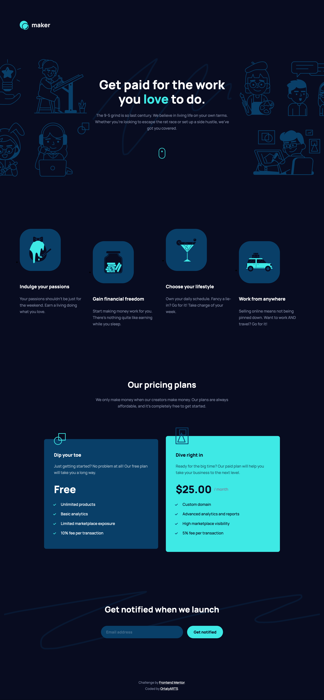

# Frontend Mentor - Maker pre-launch landing page solution

This is a solution to the [Maker pre-launch landing page challenge on Frontend Mentor](https://www.frontendmentor.io/challenges/maker-prelaunch-landing-page-WVZIJtKLd). Frontend Mentor challenges help you improve your coding skills by building realistic projects. 

## Table of contents

- [Overview](#overview)
  - [The challenge](#the-challenge)
  - [Screenshot](#screenshot)
  - [Links](#links)
- [My process](#my-process)
  - [Built with](#built-with)
- [Author](#author)

## Overview

### The challenge

Users should be able to:

- View the optimal layout depending on their device's screen size
- See hover states for interactive elements
- Receive an error message when the form is submitted if:
  - The `Email address` field is empty should show "Oops! Please add your email"
  - The email is not formatted correctly should show "Oops! That doesn’t look like an email address"

### Screenshot

### Links

- Solution URL: (https://github.com/ortalyarts/frontendmentor-maker-pre-launch-landing-page)
- Live Site URL: (https://frontendmentor-maker-pre-launch-landing-page.vercel.app/)

## My process

### Built with

- Semantic HTML5 markup
- CSS custom properties
- Flexbox
- CSS Grid
- Mobile-first workflow
- Vanilla Js for the form validation
- Accessible ARIA

## Author

- OrtalyARTS Portfolio Website - [@ortalyARTS.com](https://ortaly.com/)
- Frontend Mentor - [@ortalyARTS](https://www.frontendmentor.io/profile/ortalyARTS)
- Linkedin - [@ortalyARTS](www.linkedin.com/in/ortalyarts) 